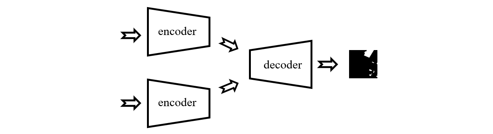
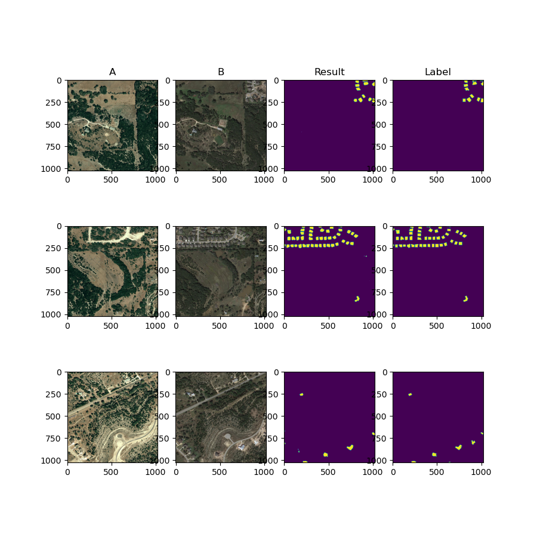

<h1 align="center">
  <b>Change Detection Models</b><br>
</h1>
<p align="center">
      <b>Python library with Neural Networks for Change Detection based on PyTorch.</b>
</p>





This project is inspired by **[segmentation_models.pytorch](https://github.com/qubvel/segmentation_models.pytorch)** and built based on it. 😄

### 🌱 How to use <a name="use"></a>

For train

### :truck: Results <a name="results"></a>



### 🔭 Models <a name="models"></a>

#### Architectures <a name="architectures"></a>
- [x] Unet [[paper](https://arxiv.org/abs/1505.04597)]

- [x] Unet++ [[paper](https://arxiv.org/pdf/1807.10165.pdf)]

- [x] MAnet [[paper](https://ieeexplore.ieee.org/abstract/document/9201310)]

- [x] Linknet [[paper](https://arxiv.org/abs/1707.03718)]

- [x] FPN [[paper](http://presentations.cocodataset.org/COCO17-Stuff-FAIR.pdf)]

- [x] PSPNet [[paper](https://arxiv.org/abs/1612.01105)]

- [x] PAN [[paper](https://arxiv.org/abs/1805.10180)]

- [x] DeepLabV3 [[paper](https://arxiv.org/abs/1706.05587)]

- [x] DeepLabV3+ [[paper](https://arxiv.org/abs/1802.02611)]

- [x] UPerNet [[paper](https://arxiv.org/abs/1807.10221)]

- [x] STANet [[paper](https://www.mdpi.com/2072-4292/12/10/1662)]


### :truck: Dataset <a name="dataset"></a>

- [x] [LEVIR-CD](https://justchenhao.github.io/LEVIR/)

### :page_with_curl: Citing <a name="citing"></a>

```
@misc{Lynchez:2021,
  Author = {Nurettin Sinnaoğlu},
  Title = {Change Detection with Pytorch},
  Year = {2021},
  Publisher = {GitHub},
  Journal = {GitHub repository},
  Howpublished = {\url{https://github.com/Lynchez/Change-Detection-with-Pytorch}}
}
```

### :books: Reference <a name="reference"></a>

- [qubvel/segmentation_models.pytorch](https://github.com/qubvel/segmentation_models.pytorch)
- [albumentations-team/albumentations](https://github.com/albumentations-team/albumentations)
- [open-mmlab/mmsegmentation](https://github.com/open-mmlab/mmsegmentation)
- [wenhwu/awesome-remote-sensing-change-detection](https://github.com/wenhwu/awesome-remote-sensing-change-detection)
- [likyoo/change_detection.pytorch](https://github.com/likyoo/change_detection.pytorch)

